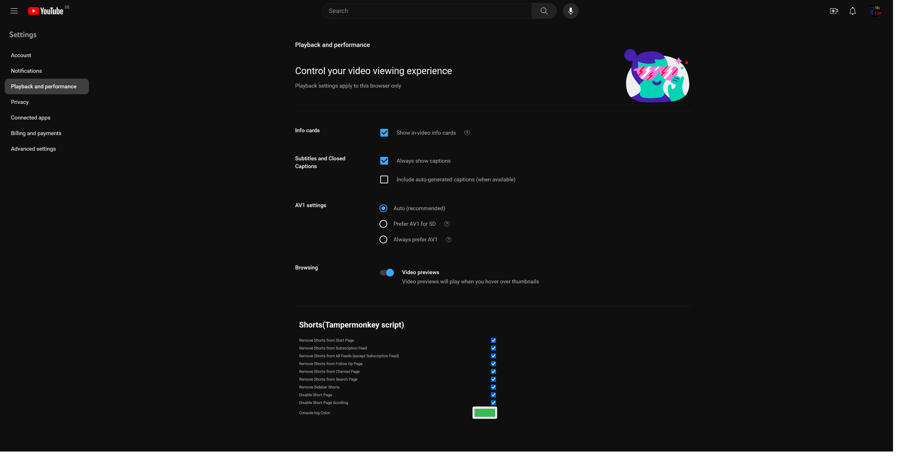

# YouTube Shorts Remover

## Description

This userscript removes YouTube Shorts from various pages on the YouTube website, including search results, watch pages, subscription feeds, and more. It provides configurable options to control which pages Shorts are removed from.

## Features

- Removes YouTube Shorts from the following pages:
  - Start page
  - Subscription feed
  - All other feed pages
  - Watch pages
  - Channel pages
  - Search results
- Disable YouTube Shorts pages.
- Configurable options to enable/disable Shorts removal on specific pages
- Disables scrolling on YouTube Shorts pages
- Logs removal activity to the browser console

## Installation

1. **Install a Userscript Manager:**
   - You need a userscript manager extension installed in your browser to run this script. Popular choices include:
     - [Tampermonkey](https://www.tampermonkey.net/) (Recommended)
     - [Greasemonkey](https://www.greasespot.net/)

3. **Install the Script:**
   - **Full Version (recommended):**
     - Install the full (merged.js) version if you want to have a configuration menu at [Settings>Playback and performance](https://www.youtube.com/account_playback). The configuration will not be saved in the account but on the browser.
     - Install the full (merged.js) version of the script by clicking on the following link and then click on the "Install" button in the userscript manager prompt:
       - [YouTube Shorts Remover Full Version](https://raw.githubusercontent.com/Mr-Comand/youtube-shorts-remover-tampermonkey/main/merrged.user.js)

   - **Base Version:**
     - Install the base (base.js) version if you want to edit the configuration directly in the script file.
     - Install the base (base.js) version of the script by clicking on the following link and then click on the "Install" button in the userscript manager prompt:
     - [YouTube Shorts Remover Base Version](https://raw.githubusercontent.com/Mr-Comand/youtube-shorts-remover-tampermonkey/main/base.user.js)

5. **Configure Options (Optional):**
    - After installing the script, you can optionally configure its options depending on the version you are using by:
        - using the configuration menu at [Settings > Playback and performance](https://www.youtube.com/account_playback)
        - editing the script directly 
    By default, all features of the script will be enabled and no changes should be needed for basic use.

## Configuration

The script provides the following configuration options:

- `c_removeFormStartPage`: Removes Shorts from the YouTube start page.
- `c_removeFormSubscriptionFeed`: Removes Shorts from the subscription feed page.
- `c_removeFormAllFeeds`: Removes Shorts from all feed pages except the subscription feed.
- `c_removeFormFollowUp`: Removes Shorts from watch pages.
- `c_removeFormChannel`: Removes Shorts from channel pages.
- `c_removeSidebar`: Removes Shorts from the sidebar.
- `c_removeFormSearch`: Removes Shorts from search results.
- `c_disableShortPage`: Disables YouTube Shorts pages.
- `c_disableShortPageScrolling`: Disables scrolling on YouTube Shorts pages.

## Configuration menu

## Usage

- Once the script is installed and configured (if necessary), it will automatically remove YouTube Shorts from the specified pages whenever you visit them on the YouTube website.

## License

This userscript is licensed under the [MIT License](LICENSE).

